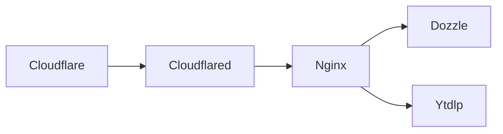
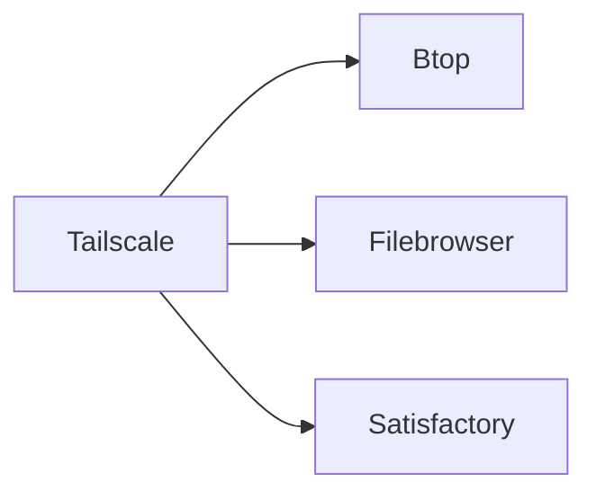

# 🏠 Homelab

A self-hosted infrastructure and application platform — running on a single server, managed as code, and designed with security, reliability, and minimal operational overhead in mind.

This repository is the single source of truth for the entire homelab environment. Every service, network rule, DNS record, access policy, and backup schedule is defined here — no manual configuration, no snowflake servers.


## Architecture

### Internet Access



### Tailscale Access



### Network flow

1. Users reach the services through Cloudflare (Dozzle, yt-dlp, btop subdomains).
2. Cloudflare Access checks the user's email against an allowlist and issues an OTP.
3. Authenticated traffic enters the server via the cloudflared tunnel.
4. NGINX routes each hostname to the correct internal container.
5. Optionally, devices on the Tailscale network can access services directly using randomized ports and ACL-defined rules.


## Philosophy

This project is built around a few core principles:

**Infrastructure as Code.**  
Everything that can be codified, is. Terraform manages DNS, tunnels, access policies, and network ACLs. Docker Compose files define every service with explicit configuration and resource limits. There are no SSH-and-pray moments.

**Defense in depth.**  
Default service ports are never used — every port is randomized. Tailscale provides a zero-trust overlay network with ACL-enforced access control. Cloudflare Tunnel fronts all public traffic, with Cloudflare Access requiring email-based authentication before any request reaches the server. The result is multiple independent layers of security.

**Segregation of concerns.**  
Services are split into two categories: **infrastructure** (what keeps the server running and observable) and **applications** (what makes the server useful). This separation makes it clear which services are foundational and which are the actual tools being hosted.

**Explicit resource governance.**  
Every single container has CPU and memory limits. No service can spike and starve another. The lab stays predictable under load.

**Backups are a first-class citizen.**  
Satisfactory game saves are backed up every 20 minutes via Restic + Rclone, orchestrated by Ofelia. Backups are treated with the same level of automation and rigour as the services themselves.


## Services

### Infrastructure

| Service | Description |
|---|---|
| [cloudflared](services/infra/cloudflared/) | Cloudflare Tunnel client |
| [nginx](services/infra/nginx/) | Reverse proxy with env-substituted config |
| [dozzle](services/infra/dozzle/) | Real-time Docker log viewer |
| [btop](services/infra/btop/) | Browser-accessible system monitor via ttyd+tmux |
| [filebrowser](services/infra/filebrowser/) | Web-based file manager |
| [ofelia](services/infra/ofelia/) | Docker-native cron scheduler |
| [rclone](services/infra/rclone/) | Rclone REST daemon (backup backend) |
| [restic](services/infra/restic/) | Restic backup client (Satisfactory data) |

### Applications

| Service | Description |
|---|---|
| [satisfactory](services/apps/satisfactory/) | Dedicated Satisfactory game server |
| [ytdlp](services/apps/ytdlp/) | Web UI for yt-dlp video downloads |


## Network security

### Port randomization

No service uses its default port. Every exposed port is configured via environment variables and randomized from the default. This eliminates automated scans targeting well-known service ports as an attack vector.

### Tailscale ACLs

Defined in [terraform/tailscale/main.tf](terraform/tailscale/main.tf), the ACL configuration implements a zero-trust overlay:

| Tag | Devices | Access |
|---|---|---|
| `tag:lab` | Server | All ports; owner-managed |
| `tag:workstation` | Monstrao, Globals (laptops) | Specific lab ports; owner-managed |
| `tag:edge` | Phone | Specific lab ports + full access to workstations; owner-managed |
| `autogroup:shared` | Shared users | Dozzle and Satisfactory only |

Rules:
- Owners have unrestricted access to everything.
- Workstations and edge devices can only reach specific randomized ports on the lab server.
- Edge devices can reach workstations fully (useful for remote access patterns).
- Shared users are limited to observability (Dozzle) and gaming (Satisfactory).

### Cloudflare Access

Defined in [terraform/cloudflare/main.tf](terraform/cloudflare/main.tf), all public-facing services require Cloudflare Access with **Email OTP** authentication. Only explicitly authorized email addresses can reach the services. SSL is set to **Flexible** mode, offloading TLS to Cloudflare's edge.


## Infrastructure as Code

### Terraform

Two modules manage the cloud layer:

**Cloudflare module** (`terraform/cloudflare/`)
- Creates a Cloudflare Zero Trust Tunnel
- Configures tunnel ingress routing hostnames → `http://nginx:80`
- Provisions DNS CNAME records for each subdomain
- Creates Cloudflare Access applications with email allowlist policies
- Sets SSL to flexible mode

**Tailscale module** (`terraform/tailscale/`)
- Discovers devices by their Tailscale hostname
- Applies tags: `tag:lab`, `tag:workstation`, `tag:edge`
- Manages the full ACL with fine-grained src/dst rules using randomized ports

### Docker Compose

All services are defined with explicit environment variables, volume mounts, network attachments, and resource limits. No `latest` tag surprises — every service pins its intentions through Compose files.


## Backups

Satisfactory game data is automatically backed up every 20 minutes using the Restic + Rclone pipeline:

1. **Ofelia** (label-based cron scheduler) triggers the backup job.
2. **Restic** reads the Satisfactory config directory (`/data`) and runs `restic backup`.
3. **Rclone** serves as a REST server backend, storing backups locally.

This ensures that even in a game server crash or data corruption scenario, the maximum data loss window is 20 minutes.


## Getting started

### Prerequisites

- Docker and Docker Compose
- Terraform ≥ 1.0
- A Cloudflare account with a zone configured
- A Tailscale tailnet with devices enrolled

### Setup

```bash
# 1. Create the shared Docker network
make setup

# 2. Bootstrap Terraform
make terraform-init

# 3. Review and apply infrastructure changes
make terraform-plan
make terraform-apply

# 4. Start infrastructure services
make infra-up

# 5. Start application services
make apps-up
```

### Environment variables

Each service directory contains a `.env.example` file. Copy it to `.env` and fill in the values:

```bash
cp services/infra/cloudflared/.env.example services/infra/cloudflared/.env
# edit .env with your tunnel token
```

The `terraform/variables.tf` file documents every Terraform variable. Create a `terraform.tfvars` with your values.


## Makefile reference

| Target | Description |
|---|---|
| `setup` | Create the `lab` Docker network |
| `infra-up` | Start all infrastructure services |
| `infra-up-build` | Start infra services with rebuild |
| `infra-down` | Stop all infrastructure services |
| `apps-up` | Start all application services |
| `apps-up-build` | Start app services with rebuild |
| `apps-down` | Stop all application services |
| `terraform-init` | Initialize Terraform |
| `terraform-init-upgrade` | Re-initialize with provider upgrades |
| `terraform-plan` | Preview infrastructure changes |
| `terraform-apply` | Apply infrastructure changes |


## Repository structure

```
lab/
├── docker/                  # Custom Dockerfile builds
│   └── btop/               # Browser-accessible system monitor
├── services/                # Docker Compose service definitions
│   ├── infra/               # Infrastructure services
│   │   ├── btop/
│   │   ├── cloudflared/
│   │   ├── dozzle/
│   │   ├── filebrowser/
│   │   ├── nginx/
│   │   ├── ofelia/
│   │   ├── rclone/
│   │   └── restic/
│   └── apps/                # Application services
│       ├── satisfactory/
│       └── ytdlp/
├── terraform/               # Infrastructure as Code
│   ├── cloudflare/          # Cloudflare tunnel, DNS, Access
│   └── tailscale/           # Device tags and ACLs
├── storage/                 # Persistent data (gitignored)
├── Makefile
└── .gitignore
```
